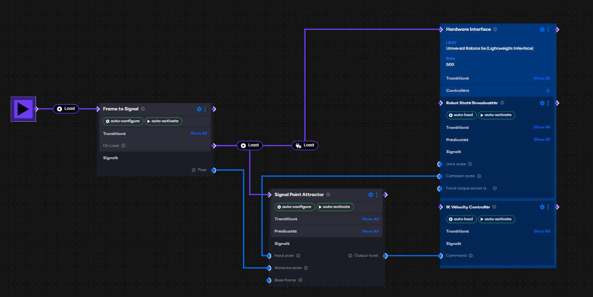

# Running Applications in Isaac Lab Using AICA System

This document provides a step-by-step guide for running robotic applications developed in **AICA Studio** within a
simulated environment in **Isaac Lab**. **Isaac Lab** is a modular framework built on **NVIDIA Isaac Sim**, designed to
simplify robotics workflows such as reinforcement learning (RL), learning from demonstrations, and motion planning. By
leveraging the PhysX engine, it offers photorealistic simulation and GPU-accelerated performance, making it a great
option for training and validating RL policies.

**AICA System** is a robotics platform that enables the creation of robotic applications using a visual, data-flow
approach in **AICA Studio**. Applications are constructed from modular blocks namely, **components**, **controllers**,
and **hardware interfaces**.

Hardware interfaces serve as bridges between the application and either physical or simulated hardware, enabling
transitions between simulated and real-world deployments.

# Motivation

By integrating the AICA System with Isaac Lab, we establish a workflow for developing, testing, and deploying robotic
applications

1. **RL Policy Testing**: AICA’s RL Policy Component SDK allows developers to deploy Reinforcement Learning (RL) models
   directly onto real hardware through components. These models can be trained in Isaac Lab, and with AICA System
   interacting directly with Isaac Lab, users can validate the trained policies under the same conditions in which they
   were learned.

2. **Reliable Policy Validation**: Developers can monitor the behaviors of the trained policies and test the effect of
   various parameters, enabling confident transitions from simulation to real-world deployment.

3. **Digital Twin Control**: Beyond RL, running AICA System with Isaac Lab provides users with ways to interact with
   digital twins of their robots. Applications can be authored, tested, and validated entirely in simulation before
   connecting to actual hardware. This improves safety and enables rapid iteration in early stages, helping streamline
   the overall development cycle.

With this integration, users can build complete automation pipelines in Isaac Lab, interact with them using AICA System,
validate performance, switch the hardware interface to a real robot, and hit play with no code changes required.

# Prerequisites

Both **Isaac Lab** and **AICA System** require Docker to be installed on your host machine. Ensure Docker is properly
installed and running before continuing.

## Installing Isaac Lab

Begin by cloning the AICA fork of [Isaac Lab](https://github.com/aica-technology/isaac-lab).

Once the repository is cloned, build and start the Docker container by running:

```shell
python3 docker/container.py start
```

This command will build the Docker image and start the container in the background.

Next, enter the running container using:

```shell
python3 docker/container.py enter
```

This ensures you are inside a development environment where Isaac Lab and all required dependencies are already
installed.

Once done, verify the installation by running

```shell
python3 scripts/custom/aica_bridge/run_bridge.py --scene basic_scene
```

This will spawn a UR5e robot, a ground plane and lights. If you see the UR5e robot in the scene, then the installation
was successful and you are ready to proceed with the next steps.

If not, go carefully go over the instructions again or reach out to our [support email](contact@aica.tech) for help.

## Installing AICA System

To run **AICA System**, you also need to install the **AICA Launcher**. Follow the installation instructions available
in the [official documentation](https://docs.aica.tech/docs/getting-started/installation/installation-and-launch).

# Connecting AICA System to Isaac Lab

In this section, we’ll walk through a simple example of using a point attractor to move a UR5e simulated robot in Isaac
Lab to a target frame and then manipulate that frame within the **AICA Studio** 3D Visualizer.

## Creating an AICA Application

To get started, follow these steps to create a new application in **AICA Studio**:

1. Open **AICA Launcher** and launch a configuration using the latest core image along with the latest Universal Robots
   collection.
2. Click the **New Application** button located in the top-left corner of the **AICA Studio** interface.
3. In the new application, add the following components:

   - **Signal Point Attractor**: Drives the robot’s movement toward a specified target frame.
   - **Frame to Signal**: Converts the target frame into a signal that feeds into the point attractor.
   - **Hardware Interface**: Connects your application to the Isaac Lab simulator, allowing you to control the UR5e
     robot and receive real-time state updates.
   - **IK Velocity Controller**: Calculates the inverse kinematics for the UR5e, enabling smooth motion toward the
     target frame.

4. Connect the events and signals as shown in the image. Make sure to auto-configure and auto-activate all components
   and controllers.



5. Press **Play**, then switch to the **3D Visualizer** tab in **AICA Studio**. You should see the UR5e robot in the
   scene. Use the **Record Frame** button to capture a target frame at the robot's tool, specify the tool frame name
   (for UR robots from the collection, that is `ur_tool0`), and then move the frame to your desired target position.
6. Once the target frame is set, parametrize the **Frame to Signal** component with the name of the target frame you
   just created.

Now that you have set up the application, let's go over the necessary steps that needs to be done on the Hardware
Interface level to connect **AICA System** to the Isaac Lab simulator.

## Configuring the Hardware Interface

The **Hardware Interface** serves as the communication bridge between the **AICA System** and external hardware or
simulators. In this example, we’ll use it to connect with the Isaac Lab simulator via ZMQ sockets.

To set up the hardware interface, follow these steps:

1. Go to the **Hardware** tab in **AICA Studio**.
2. Click on the Universal Robot 5e URDF to open it.
3. Click **Save As** to create a copy of the URDF file for the UR5e robot in **AICA Studio**.
4. In the **hardware** tag, replace the existing plugin with the lightweight interface plugin shown above.
5. Remove any unused tags, such as GPIO or other unnecessary hardware interfaces, from the URDF file.
6. Save your changes.
7. In the **Hardware Interface** component on the graph view, select the modified URDF file for the UR5e robot from the
   drop down menu in the hardware interface.

```xml
<hardware>
   <plugin>aica_core_interfaces/LightWeightInterface</plugin>
   <param name="ip">0.0.0.0</param>
   <param name="state_port">1801</param>
   <param name="command_port">1802</param>
   <param name="ft_sensor_port">1803</param>
   <param name="bind_state_port">False</param>
   <param name="bind_command_port">False</param>
   <param name="bind_ft_sensor_port">False</param>
</hardware>
```

This configuration enables the UR5e robot model to communicate with the Isaac Lab simulator by sending commands and
receiving both state and sensor data.

With the hardware interface now configured, let's jump into running the Isaac Lab simulator and running your AICA
application.

## Running the Isaac Lab Simulator

Now that you have created a new AICA application and configured the hardware interface, you can run the Isaac Lab
simulator by executing the following command in the Isaac Lab Docker container:

```shell
python3 scripts/custom/aica_bridge/run_bridge.py --scene basic_scene
```

This command will start the Isaac Sim simulator with a basic scene that includes the UR5e robot, a ground plane, and
lights. The simulator will listen for commands from the AICA application via the configured ZMQ sockets.

The simulator includes several important parameters that you should be familiar with:

- **scene**: Specifies the scene to load in the simulator.
- **rate**: Sets the simulation update rate in Hz. The default is 100 Hz, but you can adjust this to meet your
  application's needs.
- **end_effector**: Indicates the name of the end-effector link on the robot being controlled.
- **force_sensor**: Enables the robot's force sensor when set to `true`. This is useful for applications that require
  force feedback.
- **state_port**: Defines the port used to send state updates from the simulator to the AICA application. The default is
  `1801`, and it must match the `state_port` specified in the hardware interface configuration.
- **command_port**: Sets the port for receiving commands from the AICA application. The default is `1802`, and it should
  match the `command_port` in the hardware interface.
- **force_port**: Sets the port for sending force-torque sensor data. The default is `1803`, and it should align with
  the `ft_sensor_port` defined in the hardware interface.
- **command_interface**: Specifies the type of command the simulator accepts. The default is `"position"`, meaning it
  expects position commands. You can change this to `"velocity"` if required. If a mismatched command type is received,
  the simulator will terminate with a `ValueError` indicating the mismatch.
- **headless**: When set to `true`, the simulator runs in headless mode, which is useful for running simulations without
  a graphical interface.
- **device**: Specifies the device to use for simulation. The default is `cuda`, which utilizes GPU acceleration. You
  can change this to `cpu` if you want to run the simulation on the CPU instead.

Ensure these parameters are correctly configured to enable seamless communication between the simulator and your AICA
application.

# Running the AICA Application

When the simulator is running, you can execute your AICA application by clicking the **Play** button in the **AICA
Studio**.

# Creating a New Scene in Isaac Lab

To create a new scene, you should define a scene config class that inherits from InteractiveSceneCfg. Various examples
of scene config classes can be found in the [`scenes`](../scripts/custom/aica_bridge/scenes) directory of the Isaac Lab
repository.

The scene lives entirely in Isaac Lab and the definitions of the assets used in the scene should be defined there. The
3D Visualizer in **AICA Studio** will only display the robot and mirror the robot's movements, but it will not display
the scene itself.

Once you've defined your scene configuration class, register it by adding a corresponding key to the `scenes` dictionary
located in [this file](../scripts/custom/aica_bridge/scenes/__init__.py).

After registering the scene, you can launch it by running the following command in the `run_bridge.py` script:

```shell
python3 scripts/custom/aica_bridge/run_bridge.py --scene <your_scene_name>
```

# Beware

When running the **AICA System** and Isaac Lab simulator, there are several important points to keep in mind to ensure
safe and reliable performance:

1. **Robot joint names**: Ensure that the joint names in your URDF file match those expected by the USD file in Isaac
   Lab. In the current implementation, there are two sources of truth for joint names: the URDF file and USD file. If
   these names do not match, the simulator will not be able to send the states correctly to the AICA application.

2. **Hardware Interface Rate in AICA Studio**: The hardware interface rate in **AICA Studio** should be greater than the
   simulation rate in Isaac Lab. This ensures that the AICA application can send commands to the simulator at a rate
   that matches or exceeds the simulation updates, preventing command loss or delays.

3. **Simulation Rate**: The simulation rate in Isaac Lab should be set to a value that allows for smooth and realistic
   updates. Commands are updated at the simulation rate, so if the rate is too low, then the robot may skip commands or
   not respond as expected.

4. **Force Sensor**: If you enable the force sensor in the hardware interface, ensure that the simulator is configured
   to provide force-torque data. This is done by setting the `force_sensor` parameter to the name of the force sensor
   present in the URDF file. If the force sensor is not configured correctly, the simulator will not send force-torque
   data, and the AICA application may not function as expected.

5. **Command Interface**: Ensure that the command interface in the simulator matches the type of commands being sent.

# Conclusion

By following the steps outlined in this guide, you can successfully run robotic applications built using **AICA Studio**
within the Isaac Lab simulator.
